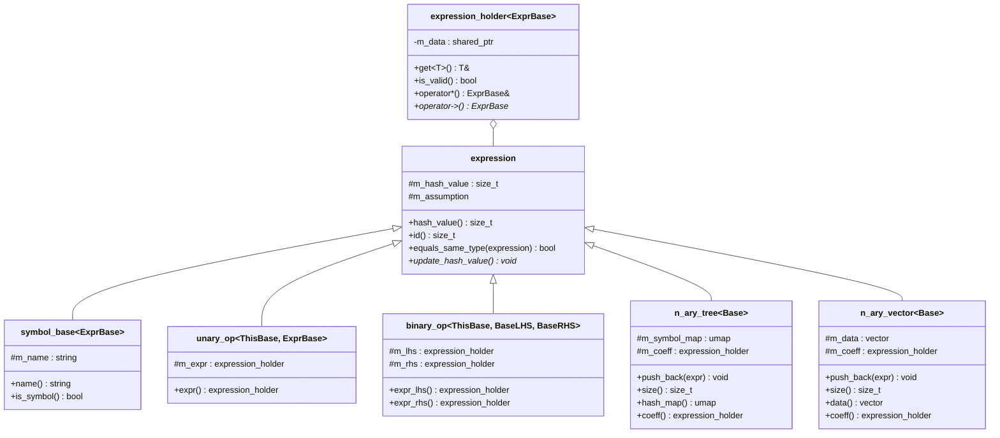
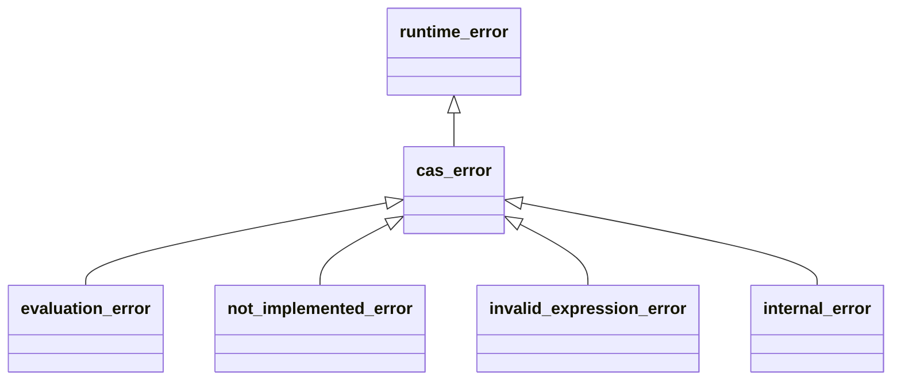

# Core Layer

The core layer provides domain-agnostic abstractions used by all three expression
domains: the expression base class, the visitor pattern infrastructure, operator
CPOs, node base classes, differentiation, domain traits, and error types.

## Class Hierarchy



## Expression System

### `expression` (`core/expression.h`)

Abstract base class for all expression nodes. Provides:

- **Hash caching** -- lazy evaluation via mutable `m_hash_value`. The pure virtual
  `update_hash_value()` is called on first access and the result is cached.
- **Type identification** -- `id()` returns a compile-time index for the node type.
- **Deep equality** -- `equals_same_type()` compares two nodes of the same concrete
  type. Used as a fallback when hashes collide.

### `expression_holder<ExprBase>` (`core/expression_holder.h`)

Type-safe RAII wrapper around `std::shared_ptr<ExprBase>`. All expressions are
held and passed through holders.

Key features:

- **Access** -- `operator*`, `operator->`, and `get<T>()` for downcasting.
- **Validity** -- `is_valid()` checks for null.
- **Compound assignment** -- `operator+=`, `operator*=` build new expressions.
- **Ordering** -- `operator<` compares by hash first, then by type id, then by
  deep comparison, with address-based tiebreaker for total ordering.
- **Negation** -- `operator-()` calls the domain's `neg_fn` CPO.

### Creating Expressions

All concrete nodes are created via the factory function:

```cpp
template <typename Node, typename... Args>
expression_holder<Base> make_expression(Args&&... args);
```

## Visitor Pattern

### Architecture (`core/visitor_base.h`)

The library uses a **virtual visitor pattern** (not `std::variant`) for
expression traversal. Three visitor variants exist:

| Variant | Class | Return | Mutates? |
|---------|-------|--------|----------|
| Returning | `visitor_return<ReturnT, Types...>` | `ReturnT` | No |
| Mutating | `visitor<Types...>` | `void` | Yes |
| Const | `visitor_const<Types...>` | `void` | No |

Each visitor defines a virtual `operator()(T&)` for every node type `T` in the
domain's node list.

### Visitable Mixin

```cpp
template <typename Base, typename... Types>
class visitable : public Base {
    virtual ReturnT accept(visitor_return<ReturnT, Types...>&) = 0;
    virtual void    accept(visitor<Types...>&) = 0;
    virtual void    accept(visitor_const<Types...>&) const = 0;
};
```

### CRTP Implementation

Concrete nodes inherit `visitable_impl<Base, Derived, Types...>` which provides:

- `accept()` implementations that cast `*this` to `Derived` and dispatch.
- `get_id()` static method returning the compile-time type index.
- `equals_same_type()` default implementation using `dynamic_cast`.

### Node List Macros

Each domain defines a macro listing all its node types. The macro is used to
generate visitor typedefs and dispatch tables:

```cpp
// Example: scalar domain
#define NUMSIM_CAS_SCALAR_NODE_LIST(FIRST, NEXT) \
  FIRST(scalar)       \
  NEXT(scalar_zero)   \
  NEXT(scalar_one)    \
  /* ... 18 more ... */ \
  NEXT(scalar_rational)
```

Generated typedefs:

| Typedef | Purpose |
|---------|---------|
| `scalar_visitor_return_expr_t` | Returning visitor (returns `expression_holder`) |
| `scalar_visitor_t` | Mutating visitor |
| `scalar_visitor_const_t` | Const visitor |
| `scalar_visitable_t` | Visitable mixin base |
| `scalar_node_base_t<T>` | Node base for concrete type `T` |

## Operators via tag_invoke CPO

### Tag-Invoke Infrastructure (`core/tag_invoke.h`)

The library uses the **Customization Point Object** (CPO) pattern for extensible
operations. The core infrastructure provides:

- `tag_invoke()` -- ADL anchor function.
- `tag_invocable<Tag, Args...>` -- concept checking if a tag_invoke overload exists.
- `tag_invoke_result_t<Tag, Args...>` -- result type alias.

### Binary Operations (`core/binary_ops.h`)

Four stateless function objects, each delegating to `tag_invoke`:

| CPO | Global Instance | Operation |
|-----|-----------------|-----------|
| `add_fn` | `binary_add` | Addition |
| `sub_fn` | `binary_sub` | Subtraction |
| `mul_fn` | `binary_mul` | Multiplication |
| `div_fn` | `binary_div` | Division |

### User-Facing Operators (`core/operators.h`)

Overloads for `+`, `-`, `*`, `/` that support mixed expression/arithmetic
operands. The `cas_binary_op<L, R>` concept requires at least one operand to be
an `expression_holder`. Arithmetic types are promoted to constants via
`to_holder_like<H>()`.

```cpp
// Works with mixed types:
auto expr = x + 2;        // scalar + int
auto expr2 = 3.0 * X;     // double * tensor
```

## Node Base Classes

### `symbol_base<ExprBase>` (`core/symbol_base.h`)

Named leaf node (variable). Stores a `std::string` name. Move-only semantics.
Hash is computed from the name string.

### `unary_op<ThisBase, ExprBase>` (`core/unary_op.h`)

Template base for single-operand nodes. Stores one child via `m_expr`.
Hash combines the node id with the child's hash.

### `binary_op<ThisBase, BaseLHS, BaseRHS>` (`core/binary_op.h`)

Template base for two-operand nodes. Stores `m_lhs` and `m_rhs` as
`expression_holder` instances. Supports heterogeneous operand types (e.g.,
`scalar_expression` LHS and `tensor_expression` RHS for `tensor_scalar_mul`).

### `n_ary_tree<Base>` (`core/n_ary_tree.h`)

Variable-arity node using **hash map** storage for deduplication. Used for
commutative operations (add, mul) where child order doesn't matter.

- Children stored in `umap<expr_holder_t>` keyed by expression hash.
- Separate `m_coeff` field for the coefficient.
- `push_back()` asserts no duplicate children.
- Hash is computed from **sorted child hashes** (excludes coefficient).

### `n_ary_vector<Base>` (`core/n_ary_vector.h`)

Variable-arity node using **vector** storage, preserving insertion order. Used
for ordered products (e.g., `tensor_mul`) where operand order matters.

- Children stored in `std::vector<expr_holder_t>`.
- Separate `m_coeff` field.
- Same sorted-hash computation as `n_ary_tree`.

## Differentiation CPO

### `diff_fn` (`core/diff.h`)

Tag-invoke CPO for symbolic differentiation. Two overload levels:

```cpp
// Typed call (explicit domain types)
diff(type_identity<ExprBase>, type_identity<ArgBase>, expr, arg);

// Ergonomic call (deduces types)
auto result = diff(expr, arg);
```

Each domain provides a `tag_invoke` overload that constructs the appropriate
differentiation visitor. See [Differentiation](differentiation.md) for rules.

## Domain Traits

### `domain_traits<Domain>` (`core/domain_traits.h`)

Primary template (empty) designed for specialization by each domain. Provides
a uniform interface for generic algorithms (simplifiers):

```cpp
template <> struct domain_traits<scalar_expression> {
    using expression_type = scalar_expression;
    using expr_holder_t   = expression_holder<scalar_expression>;
    using add_type        = scalar_add;
    using mul_type        = scalar_mul;
    using negative_type   = scalar_negative;
    using zero_type       = scalar_zero;
    using one_type        = scalar_one;
    using constant_type   = scalar_constant;
    using pow_type        = scalar_pow;
    using symbol_type     = scalar;

    static expr_holder_t zero();
    static expr_holder_t one();
    static std::optional<scalar_number> try_numeric(expr_holder_t const &);
    static expr_holder_t make_constant(scalar_number const &);
};
```

Generic simplifier algorithms (in `core/simplifier/`) use these traits with
`if constexpr` guards for domain-specific behavior. For example, the scalar
domain's `constant_type` has `.value()` for direct arithmetic, while the
tensor-to-scalar domain wraps scalar expressions.

## Error Hierarchy

### `cas_error.h` (`core/cas_error.h`)



| Exception | Usage |
|-----------|-------|
| `cas_error` | Base CAS exception |
| `evaluation_error` | Evaluation failures (missing symbol bindings) |
| `not_implemented_error` | Unimplemented features (e.g., higher-rank inverse) |
| `invalid_expression_error` | Invalid expression access (null holder) |
| `internal_error` | Internal library errors (e.g., duplicate n_ary_tree child) |

## File Reference

| File | Purpose |
|------|---------|
| `core/expression.h` | Abstract expression base class |
| `core/expression_holder.h` | Smart pointer wrapper |
| `core/visitor_base.h` | Visitor pattern infrastructure |
| `core/tag_invoke.h` | CPO framework |
| `core/binary_ops.h` | Binary operation CPOs |
| `core/operators.h` | User-facing `+`, `-`, `*`, `/` |
| `core/symbol_base.h` | Named symbol base |
| `core/unary_op.h` | Unary operation base |
| `core/binary_op.h` | Binary operation base |
| `core/n_ary_tree.h` | N-ary hash map node |
| `core/n_ary_vector.h` | N-ary vector node |
| `core/diff.h` | Differentiation CPO |
| `core/domain_traits.h` | Domain traits primary template |
| `core/cas_error.h` | Exception hierarchy |
| `core/evaluator_base.h` | Evaluator base (symbol map + dispatch) |
| `core/substitute.h` | Substitution CPO |
