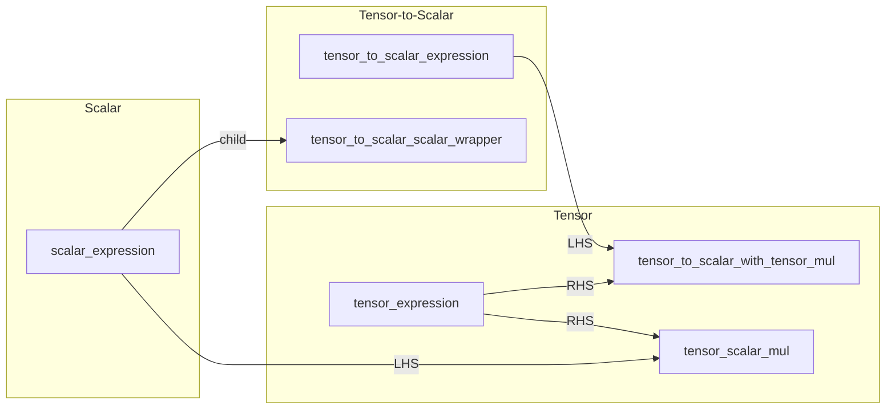
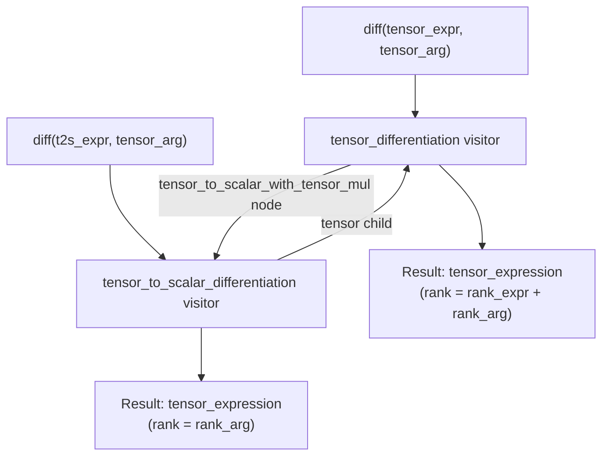
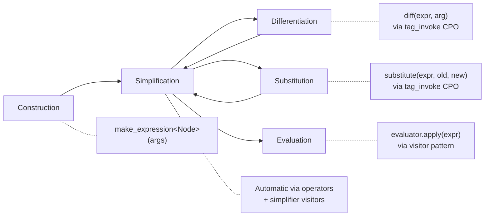

# Cross-Domain Interactions

The three expression domains (scalar, tensor, tensor-to-scalar) are not fully
isolated -- they interact through cross-domain nodes, operator promotions, and
recursive visitor traversals. This document covers these interactions, the
expression lifecycle, and the build system.

## Cross-Domain Expression Types



### `tensor_scalar_mul` (Scalar x Tensor -> Tensor)

**File:** `tensor/operators/scalar/tensor_scalar_mul.h`

A `binary_op` with `scalar_expression` as LHS and `tensor_expression` as RHS.
Result is a tensor expression.

```cpp
auto c = make_expression<scalar_constant>(2.0);
auto X = make_expression<tensor>("X", 3, 2);
auto scaled = c * X;  // tensor_scalar_mul node
```

**Hash behavior:** When the scalar LHS is a constant, the hash is set to the
RHS hash only (the constant coefficient does not affect ordering). This enables
simplifications like `2*X + 3*X = 5*X` by hash-matching the tensor parts.

### `tensor_to_scalar_with_tensor_mul` (T2S x Tensor -> Tensor)

**File:** `tensor/operators/tensor_to_scalar/tensor_to_scalar_with_tensor_mul.h`

A `binary_op` with `tensor_expression` as LHS and `tensor_to_scalar_expression`
as RHS (stored in a cross-domain binary_op). Result is a tensor expression.

```cpp
auto X = make_expression<tensor>("X", 3, 2);
auto f = det(X);  // tensor_to_scalar_expression
// f * X is a tensor_to_scalar_with_tensor_mul node
```

This node arises primarily during differentiation when the product rule
creates terms like `f * dA/dX` where `f` is a T2S expression.

### `tensor_to_scalar_scalar_wrapper` (Scalar -> T2S)

**File:** `tensor_to_scalar/tensor_to_scalar_scalar_wrapper.h`

A `unary_op` wrapping a `scalar_expression` as a T2S expression. Enables
scalar constants and variables to participate in T2S arithmetic.

```cpp
auto x = make_expression<scalar>("x");
auto tr = trace(X);
auto sum = tr + x;  // x is promoted to T2S via scalar_wrapper
```

## Cross-Domain Differentiation

Differentiation is the primary mechanism driving cross-domain interactions.



### How Cross-Domain Recursion Works

1. **Tensor diff encounters T2S child:**
   When differentiating `tensor_to_scalar_with_tensor_mul` (f * A), the tensor
   differentiator calls `diff(f, X)` which invokes the T2S differentiator.

2. **T2S diff encounters tensor child:**
   When differentiating `trace(A)`, the T2S differentiator calls `diff(A, X)`
   which invokes the tensor differentiator.

### Circular Include Resolution

The `.h` headers forward-declare the cross-domain `tag_invoke` overloads. Actual
definitions live in `.cpp` files that include both domain headers:

```
tensor_differentiation.h              tensor_to_scalar_differentiation.h
  (forward-declares t2s diff)           (forward-declares tensor diff)
         |                                       |
         v                                       v
tensor_differentiation.cpp            tensor_to_scalar_differentiation.cpp
  #include tensor_diff.h               #include tensor_diff.h
  #include t2s_diff.h                  #include t2s_diff.h
```

### Cross-Domain Differentiation Examples

**Determinant of tensor** (T2S -> tensor):

$$\frac{\partial \det(\mathbf{A})}{\partial \mathbf{X}} = \det(\mathbf{A}) \cdot \mathbf{A}^{-\top} : \frac{\partial \mathbf{A}}{\partial \mathbf{X}}$$

**Scalar-tensor product** (tensor with T2S coefficient):

$$\frac{\partial (f \cdot \mathbf{A})}{\partial \mathbf{X}} = f \cdot \frac{\partial \mathbf{A}}{\partial \mathbf{X}} + \mathbf{A} \otimes \frac{\partial f}{\partial \mathbf{X}}$$

## Cross-Domain Visitors

### Evaluators

Each domain's evaluator contains internal evaluators for dependent domains:

| Evaluator | Internal Evaluators |
|-----------|-------------------|
| `scalar_evaluator<V>` | (none -- leaf domain) |
| `tensor_evaluator<V>` | `scalar_evaluator<V>` |
| `tensor_to_scalar_evaluator<V>` | `tensor_evaluator<V>`, `scalar_evaluator<V>` |

Symbol bindings propagate through the chain. When setting a tensor value on a
T2S evaluator, it is forwarded to the internal tensor evaluator.

### Substitution

Each domain's substitution visitor is templated on `TargetBase`, enabling
cross-domain replacement:

```cpp
// Replace scalar variable inside a tensor expression
auto result = substitute(tensor_expr, old_scalar, new_scalar);

// Replace tensor variable inside a T2S expression
auto result = substitute(t2s_expr, old_tensor, new_tensor);
```

### Printers

Each domain's printer can recurse into dependent domains:
- `tensor_printer` handles `tensor_scalar_mul` by printing the scalar child.
- `tensor_to_scalar_printer` prints tensor children within `tensor_trace`,
  `tensor_det`, etc.

## Expression Lifecycle



### 1. Construction

Expressions are built using `make_expression<Node>(args...)` or operator
overloads. Each node is allocated on the heap and wrapped in an
`expression_holder` (shared pointer).

### 2. Simplification

Happens **automatically** during construction. When operators (`+`, `-`, `*`, `/`)
are called, they dispatch to simplifier visitors that apply algebraic rules
before creating the result node. Key rules:

- Constant folding: `2 + 3 = 5`
- Identity elimination: `x + 0 = x`, `x * 1 = x`
- Like-term collection: `x + x = 2*x`
- Power combination: `x * x = pow(x, 2)`
- Nested flattening: `(a + b) + c` merges into single `add` node

### 3. Differentiation

Invoked via the `diff(expr, arg)` CPO. Returns a new expression tree
representing the symbolic derivative. The result undergoes simplification
through the same operator pipeline.

### 4. Substitution

Replaces sub-expressions: `substitute(expr, old, new)`. Rebuilds the expression
tree with all occurrences of `old` replaced by `new`.

### 5. Evaluation

Converts symbolic expressions to numeric values. Requires binding variables
to numeric values via `evaluator.set(symbol, value)`, then calling
`evaluator.apply(expr)`.

## Build System

### CMake Configuration

The project uses CMake with C++23 standard.

```cmake
cmake_minimum_required(VERSION 3.14)
project(numsim_cas)

set(CMAKE_CXX_STANDARD 23)
set(CMAKE_CXX_STANDARD_REQUIRED ON)
```

### Source Discovery

Uses `GLOB_RECURSE` to auto-discover all `.cpp` files under `src/`:

```cmake
file(GLOB_RECURSE SOURCES "src/*.cpp")
```

New `.cpp` files are automatically included after running `cmake -B build`.

### Dependencies

- **tmech** -- tensor mechanics library for numeric evaluation. Fetched
  automatically if not found via `FetchContent`.
- **GTest** -- Google Test framework for unit tests (optional, controlled by
  `BUILD_TESTS`).

### Building

```bash
cmake -B build
cmake --build build
```

### Testing

```bash
cmake --build build
cd build && ctest
```

Tests are organized in header files under `tests/`:

| Test File | Coverage |
|-----------|----------|
| `ScalarExpressionTest.h` | Scalar algebra, printing, simplification |
| `TensorExpressionTest.h` | Tensor algebra, printing |
| `TensorToScalarExpressionTest.h` | T2S algebra, printing |
| `ScalarEvaluatorTest.h` | Scalar numeric evaluation |
| `TensorEvaluatorTest.h` | Tensor numeric evaluation |
| `TensorToScalarEvaluatorTest.h` | T2S numeric evaluation |
| `ScalarDifferentiationTest.h` | Scalar differentiation rules |
| `TensorDifferentiationTest.h` | Tensor differentiation rules |
| `TensorToScalarDifferentiationTest.h` | T2S differentiation rules |
| `TensorSubstitutionTest.h` | Expression substitution |
| `CoreBugFixTest.h` | Regression tests for core bugs |

### Project Structure

```
numsim-cas/
├── include/numsim_cas/
│   ├── core/                    # Domain-agnostic abstractions
│   │   ├── expression.h
│   │   ├── expression_holder.h
│   │   ├── visitor_base.h
│   │   ├── binary_ops.h
│   │   ├── operators.h
│   │   ├── tag_invoke.h
│   │   ├── diff.h
│   │   ├── substitute.h
│   │   ├── domain_traits.h
│   │   ├── cas_error.h
│   │   ├── evaluator_base.h
│   │   ├── unary_op.h
│   │   ├── binary_op.h
│   │   ├── n_ary_tree.h
│   │   ├── n_ary_vector.h
│   │   └── simplifier/         # Generic simplifier algorithms
│   ├── scalar/
│   │   ├── scalar_node_list.h
│   │   ├── scalar_expression.h
│   │   ├── scalar_operators.h
│   │   ├── scalar_domain_traits.h
│   │   ├── scalar_*.h           # Node headers
│   │   ├── visitors/            # Printer, evaluator, diff, substitution
│   │   └── simplifier/          # Add, sub, mul, pow simplifiers
│   ├── tensor/
│   │   ├── tensor_node_list.h
│   │   ├── tensor_expression.h
│   │   ├── tensor_operators.h
│   │   ├── tensor_functions.h
│   │   ├── sequence.h
│   │   ├── tensor_*.h           # Node headers
│   │   ├── operators/           # Cross-domain node headers
│   │   ├── visitors/            # Printer, evaluator, diff, substitution
│   │   ├── simplifier/          # Add, sub, mul simplifiers
│   │   └── data/                # Numeric tensor data wrappers
│   ├── tensor_to_scalar/
│   │   ├── tensor_to_scalar_node_list.h
│   │   ├── tensor_to_scalar_expression.h
│   │   ├── tensor_to_scalar_operators.h
│   │   ├── tensor_to_scalar_functions.h
│   │   ├── tensor_to_scalar_*.h # Node headers
│   │   ├── visitors/            # Printer, evaluator, diff, substitution
│   │   └── simplifier/          # Add, sub, mul, pow simplifiers
│   ├── printer_base.h
│   ├── basic_functions.h
│   └── numsim_cas.h             # Main aggregate header
├── src/numsim_cas/              # .cpp implementations
│   ├── scalar/
│   ├── tensor/
│   └── tensor_to_scalar/
├── tests/                       # GTest test suites
├── docs/                        # This documentation
└── CMakeLists.txt
```
