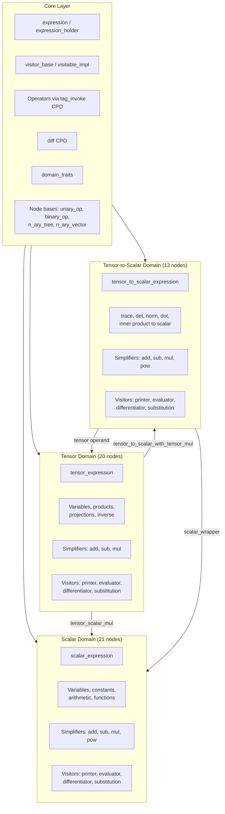

# numsim-cas Documentation

**numsim-cas** is a C++23 header-only computer algebra system (CAS) for symbolic
computation in continuum mechanics. It provides three expression domains for
building, simplifying, differentiating, and evaluating symbolic expressions
involving scalars and tensors.

## Architecture Overview



## Quick Start

```cpp
#include <numsim_cas/numsim_cas.h>
#include <numsim_cas/tensor/tensor_diff.h>
#include <numsim_cas/tensor/tensor_std.h>
#include <numsim_cas/tensor_to_scalar/tensor_to_scalar_diff.h>
#include <numsim_cas/tensor_to_scalar/tensor_to_scalar_std.h>

using namespace numsim::cas;

// Create scalar variables
auto x = make_expression<scalar>("x");
auto y = make_expression<scalar>("y");

// Build scalar expression and evaluate
auto f = x * x + 2 * y;
scalar_evaluator<double> ev;
ev.set(x, 3.0);
ev.set(y, 5.0);
double result = ev.apply(f);  // 19.0

// Create tensor variables (dim=3, rank=2)
auto X = make_expression<tensor>("X", 3, 2);
auto Y = make_expression<tensor>("Y", 3, 2);

// Differentiate trace(X) with respect to X
auto tr = trace(X);
auto dtr = diff(tr, X);  // kronecker_delta (identity)

// Differentiate determinant
auto d = det(X);
auto dd = diff(d, X);    // det(X) * inv(trans(X))
```

## Documentation

| Document | Description |
|----------|-------------|
| [Core Layer](core.md) | Expression system, visitor pattern, operators, node bases, domain traits, errors |
| [Scalar Domain](scalar.md) | 21 node types, operators, simplifiers, visitors, evaluation |
| [Tensor Domain](tensor.md) | 20 node types, index/sequence system, tensor functions, visitors |
| [Tensor-to-Scalar Domain](tensor-to-scalar.md) | 13 node types, trace/det/norm functions, simplifiers |
| [Cross-Domain Interactions](cross-domain.md) | Cross-domain nodes, expression lifecycle, build system |
| [Differentiation](differentiation.md) | Symbolic differentiation rules with mathematical notation |
