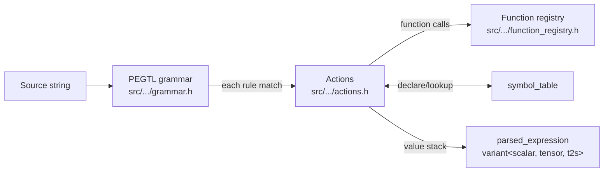

# String Parser

The string parser converts source-code expressions into the same
`expression_holder<...>` ASTs that the rest of the library builds via
C++ factories and operator overloads. Implemented with
[taocpp/PEGTL](https://github.com/taocpp/PEGTL); lives behind the
`NUMSIM_CAS_BUILD_PARSER=ON` CMake option (default OFF), so consumers
that don't need it pay no compile cost.

Tracked under [#214](https://github.com/NumSim-Stack/numsim-cas/issues/214).

## Quick Start

```cpp
#include <numsim_cas/parser/parser.h>
#include <numsim_cas/parser/symbol_table.h>
#include <numsim_cas/scalar/visitors/scalar_evaluator.h>

namespace cas = numsim::cas;

cas::parser::symbol_table syms;
auto e = cas::parser::parse_scalar("a*x^2 + b*x + c", syms);

cas::scalar_evaluator<double> ev;
ev.set(syms.get_or_declare_scalar("a"), 1.0);
ev.set(syms.get_or_declare_scalar("b"), -3.0);
ev.set(syms.get_or_declare_scalar("c"), 2.0);
ev.set(syms.get_or_declare_scalar("x"), 1.0);

double y = ev.apply(e);  // 0 — a root of (x-1)(x-2)
```

Four worked examples live under `examples/`:
[`parser_basics.cpp`](../examples/parser_basics.cpp),
[`parser_symbol_table.cpp`](../examples/parser_symbol_table.cpp),
[`parser_error_handling.cpp`](../examples/parser_error_handling.cpp),
[`parser_tensor_diff.cpp`](../examples/parser_tensor_diff.cpp).

## Pipeline



Source is fed to the PEGTL grammar. Each rule match fires an action
that pushes onto a value stack; binary-op tails pop two values and
push the combined result. Function-call rules look the name up in
the registry, type-check the argument kinds, and call the dispatch
lambda. The final stack value is returned as the
`parsed_expression` variant.

## Grammar (EBNF)

Operator precedence runs lowest to highest:

| Level | Operators | Associativity | Example |
|-------|-----------|---------------|---------|
| 1 | `==` `!=`            | left          | `a == b` |
| 2 | `<` `<=` `>` `>=`    | left          | `a < b < c` (C-style) |
| 3 | `+` `-` (binary)     | left          | `a - b - c = (a-b) - c` |
| 4 | `*` `/`              | left          | `a / b / c = (a/b) / c` |
| 5 | `-` (unary)          | right         | `--x = -(-x)` |
| 6 | `^` (power)          | right         | `2^3^2 = 2^(3^2) = 512` |

```ebnf
expression       = eq_term ;
eq_term          = cmp_term  , { ('==' | '!=') , cmp_term  } ;
cmp_term         = add_term  , { ('<' | '<=' | '>' | '>=') , add_term  } ;
add_term         = mul_term  , { ('+' | '-') , mul_term  } ;
mul_term         = unary     , { ('*' | '/') , unary     } ;
unary            = '-' , unary | power ;
power            = primary , [ '^' , power ] ;                  (* right-recursive *)
primary          = number | function_call | tensor_decl
                 | identifier | '(' , expression , ')' ;

number           = digits , [ '.' , [ digits ] ] | '.' , digits ;
digits           = digit , { digit } ;
identifier       = (alpha | '_') , { alnum | '_' } ;

function_call    = identifier , '(' , [ arg_list ] , ')' ;
arg_list         = arg_item , { ',' , arg_item } ;
arg_item         = index_list_literal | expression ;
index_list_literal = '[' , integer , { ',' , integer } , ']' ;  (* 1-based *)

tensor_decl      = identifier , '{' , tensor_kv_list , '}' ;
tensor_kv_list   = tensor_kv , { ',' , tensor_kv } ;
tensor_kv        = ('rank' | 'dim') , '=' , integer ;
```

Whitespace (`[ \t\n\r]+`) is freely skipped between tokens but never
inside identifiers or numbers. Comparison operators evaluate to scalar
indicators (`1.0` / `0.0`), so `a < b < c` parses C-style as
`(a < b) < c`, **not** as math-style `(a < b) AND (b < c)`. Number
parsing uses `std::from_chars` and is locale-independent — `1.5` is
always one-and-a-half, regardless of `LC_NUMERIC`.

## Type System

Identifiers are typed lazily by the parser:

- **Bare identifier in scalar position** → implicit scalar declaration on first use. Repeated references resolve to the same holder.
- **`Name{rank=R, dim=D}`** → tensor declaration. After the first use, bare `Name` references resolve to the same tensor holder via the symbol table.
- **Identical re-declaration** (`A{rank=2, dim=3}` after a prior `A{rank=2, dim=3}`) is a no-op.
- **Mismatched re-declaration** (different `rank` or `dim`) raises `redeclaration_error`.
- **Cross-type collision** (`x` as scalar then `x{rank=2, dim=3}` as tensor, or vice versa) raises `type_collision_error`.

### Mixed-domain operator coercion

The supported `tag_invoke` surface is hand-listed in the parser's
`can_mul` / `can_div` predicates (see `src/numsim_cas/parser/actions.h`).
The parser is intentionally narrower than the full library coercion
surface — combinations needed for non-trivial mechanics expressions
are in, the rest throw `type_mismatch_error`.

`+` and `-` require **same-domain** operands:

| Operator | Left   | Right  | Result |
|----------|--------|--------|--------|
| `+` `-`  | scalar | scalar | scalar |
| `+` `-`  | tensor | tensor | tensor |
| `+` `-`  | t2s    | t2s    | t2s    |

`*` allows scalar-coefficient flow into either tensor side and
same-domain on t2s:

| Operator | Left   | Right  | Result |
|----------|--------|--------|--------|
| `*`      | scalar | scalar | scalar |
| `*`      | scalar | tensor | tensor |
| `*`      | tensor | scalar | tensor |
| `*`      | scalar | t2s    | t2s    |
| `*`      | t2s    | scalar | t2s    |
| `*`      | t2s    | t2s    | t2s    |

`/` is even narrower — scalar denominators only, plus same-domain
on t2s:

| Operator | Left   | Right  | Result |
|----------|--------|--------|--------|
| `/`      | scalar | scalar | scalar |
| `/`      | tensor | scalar | tensor |
| `/`      | t2s    | scalar | t2s    |
| `/`      | t2s    | t2s    | t2s    |

Notable exclusions: `tensor * tensor` (use `inner_product` /
`dot_product` explicitly), `tensor * t2s` / `t2s * tensor` (no
auto-coercion in either direction), `tensor / t2s`. The plan
originally listed broader coverage; the implementation narrowed
to what `tag_invoke` overloads exist in the codebase today.

## Function Registry

Functions are dispatched through a static table in
`function_registry.h`. Current entries:

| Group | Functions | Signature |
|-------|-----------|-----------|
| Scalar unary | `sin` `cos` `tan` `asin` `acos` `atan` `sinh` `cosh` `tanh` `asinh` `acosh` `atanh` `exp` `log` `log10` `sqrt` `abs` `sign` `macauley_plus` `macauley_minus` `heaviside` | scalar → scalar |
| Scalar binary | `pow` `lt` `le` `gt` `ge` `eq` `ne` `max` `min` `smoothed_macauley` | (scalar, scalar) → scalar |
| Scalar ternary | `if_then_else` | (scalar, scalar, scalar) → scalar |
| Tensor → tensor | `trans` `inv` `sym` `dev` `vol` `skew` | tensor → tensor |
| Tensor → tensor (binary) | `otimes` (alias: `outer_product`) | (tensor, tensor) → tensor |
| Tensor → t2s | `trace` `det` `norm` `dot` | tensor → t2s |
| Contraction → tensor | `inner_product` | (tensor, `[i…]`, tensor, `[i…]`) → tensor |
| Contraction → t2s | `dot_product` | (tensor, `[i…]`, tensor, `[i…]`) → t2s |

Indices inside `[…]` are **1-based** in the source language and
converted to 0-based `sequence` internally. Out-of-range index
validation is deferred to the underlying library at evaluation time.

**Round-trip caveat (deferred to β-2d).** Eleven of the scalar functions —
`sinh`, `cosh`, `tanh`, `asinh`, `acosh`, `atanh`, `log10`,
`macauley_plus`, `macauley_minus`, `heaviside`, `smoothed_macauley`
— have no dedicated AST node. The factory lowers them to compound
expressions at parse time (`macauley_plus(x)` → `max(x, 0)`,
`heaviside(x)` → `ge(x, 0)`, etc.). Re-parse of the printed form
gives a semantically identical (hash-equal) expression but loses
the source name. The `*LowersTo*` tests in `tests/ParserTest.h`
lock these lowerings.

Still to land (currently throws `unknown_function_error` or
`type_mismatch_error`):

- 4-arg index-list form of `outer_product`
  (`otimes(A, [i…], B, [j…])`) — needs bracket-list grammar
- Tensor branches of `if_then_else` (scalar cond, tensor then,
  tensor else) — the registry binds the 3-scalar overload only;
  tensor-piecewise is tracked in
  [#210](https://github.com/NumSim-Stack/numsim-cas/issues/210)

## Ten Example Expressions

All ten parse against the current registry:

| # | Input | Domain | Notes |
|---|-------|--------|-------|
| 1 | `42` | scalar | integer literal |
| 2 | `3.14` | scalar | decimal literal (locale-independent; no exponent — `1.5e3` is unsupported) |
| 3 | `sin(x)^2 + cos(x)^2` | scalar | implicit scalar `x`; differentiates to 0 |
| 4 | `a*x^2 + b*x + c` | scalar | four implicit scalars |
| 5 | `2 ^ 3 ^ 2` | scalar | right-assoc → 512, not 64 |
| 6 | `pow(x, 3) - 2*pow(x, 2) + x` | scalar | function-call form of `^`, mixed with scalar `*` |
| 7 | `lt(x, 0) * x + ge(x, 0) * x` | scalar | comparisons produce `0.0` / `1.0` indicators |
| 8 | `trace(A{rank=2, dim=3})` | t2s | declares `A`; `diff(., A) = I` |
| 9 | `2 * trace(A{rank=2, dim=3}) + det(A)` | t2s | scalar coefficients into t2s, declared `A` reused bare |
| 10 | `inner_product(A{rank=4, dim=3}, [3, 4], B{rank=2, dim=3}, [1, 2])` | tensor | full contraction with 1-based index sequences |

### Eventually-supported

These still raise `unknown_function_error` or `type_mismatch_error`:

- `outer_product(A, [3, 4], B, [1, 2])` — 4-arg index-list form
  needs bracket-list grammar; the 2-arg form parses
- `if_then_else(gt(x, 0), A, B)` where `A`/`B` are tensors — only the
  scalar overload is registered. The `tensor_if_then_else` and
  `tensor_to_scalar_if_then_else` C++ nodes exist on `main`; the gap
  is registry-side. The current registry binds one entry per name,
  so adding the tensor overload requires extending dispatch to key on
  `(name, arg_kinds)` or registering separate names. Tracked under
  [#229](https://github.com/NumSim-Stack/numsim-cas/issues/229)'s
  remaining checkboxes.

## Error Catalogue

All parser errors inherit from `numsim::cas::parser::parse_error`
which itself inherits from `cas_error`. Each carries `position()`,
`line()`, `column()`, and renders `what()` with a snippet plus caret.

| Subclass | When fired | Extra fields |
|----------|-----------|--------------|
| `lexical_error` | malformed literal: `[0, …]` (1-based index), bracket-list overflow | — |
| `syntax_error` | unexpected token, missing `)` / `}` / `]`, premature EOF, zero rank/dim in tensor decl, duplicate `rank=` / `dim=` keyword, PEGTL `must<>` failure | — |
| `unknown_function_error` | identifier in call position not in the registry | `name()` |
| `arity_error` | function called with wrong number of arguments | `function()`, `expected_arity()`, `actual_arity()` |
| `type_mismatch_error` | wrong domain for an operator or function argument (e.g. `sin(A{…})`) | — |
| `redeclaration_error` | tensor re-declared with mismatched `(rank, dim)` | — |
| `type_collision_error` | identifier used as both scalar and tensor in either order | — |
| `unknown_symbol_error` | **currently unreachable from the parser** — every bare identifier in scalar position is implicitly declared. Class exists for potential future strict-mode use; constructed directly by tests. | `name()` |

### Example diagnostic output

```text
parse error at 1:1: function 'sin' expects 1 argument, got 2
  sin(x, y)
  ^
```

```text
parse error at 1:7: tensor declaration 'A': rank must be >= 1, got 0
  trace(A{rank=0, dim=3})
        ^
```

## Build

```cmake
option(NUMSIM_CAS_BUILD_PARSER "Build the PEGTL string parser" OFF)
```

When ON, the build fetches PEGTL 3.2.8 via FetchContent, compiles
the `NumSim_CAS_Parser` library, and exposes it as the
`NumSim_CAS::Parser` alias. Link against both `NumSim_CAS` and
`NumSim_CAS::Parser` (or just the latter — `NumSim_CAS` is
transitively re-exported).

The public parser headers (`<numsim_cas/parser/*.h>`) **do not**
transitively include PEGTL. Consumers that include only those
headers pay no PEGTL template compile cost; the grammar
instantiations are contained inside the parser library's
translation units. The example programs under `examples/` act as
a lock-in for that constraint.

## Symbol Table Semantics

`symbol_table` is the parser's identifier→holder map.

- **Reentrant** on **distinct** instances — multiple parses can run
  concurrently if each has its own table.
- **Not** thread-safe across one shared table.
- **Non-transactional on parse failure**: declarations that landed
  before a throw stay in the table. For interactive surfaces (REPL,
  retry-on-error), discard the table or hold an external snapshot.
  Tracked as [#222](https://github.com/NumSim-Stack/numsim-cas/issues/222).

## Known Follow-Ups

- [#217](https://github.com/NumSim-Stack/numsim-cas/issues/217) — derive registry `arg_kinds` from dispatch lambda signature (single source of truth)
- [#221](https://github.com/NumSim-Stack/numsim-cas/issues/221) — umbrella header `numsim_cas/numsim_cas.h` doesn't pull in tensor / t2s diff routes
- [#222](https://github.com/NumSim-Stack/numsim-cas/issues/222) — transactional symbol_table for interactive parsing
