# Scalar Domain

The scalar domain represents symbolic scalar expressions -- real-valued quantities
built from variables, constants, arithmetic operations, and mathematical
functions. It is the simplest of the three domains and serves as the coefficient
type for tensor expressions.

## Node Hierarchy

```mermaid
classDiagram
    class scalar_expression {
        <<abstract>>
    }

    class scalar["scalar (symbol)"]
    class scalar_zero
    class scalar_one
    class scalar_constant

    class scalar_add["scalar_add (n_ary_tree)"]
    class scalar_mul["scalar_mul (n_ary_tree)"]
    class scalar_negative["scalar_negative (unary_op)"]
    class scalar_pow["scalar_pow (binary_op)"]
    class scalar_rational["scalar_rational"]

    class scalar_sin["scalar_sin"]
    class scalar_cos["scalar_cos"]
    class scalar_tan["scalar_tan"]
    class scalar_asin["scalar_asin"]
    class scalar_acos["scalar_acos"]
    class scalar_atan["scalar_atan"]
    class scalar_sqrt["scalar_sqrt"]
    class scalar_log["scalar_log"]
    class scalar_exp["scalar_exp"]
    class scalar_sign["scalar_sign"]
    class scalar_abs["scalar_abs"]
    class scalar_function["scalar_function"]

    scalar_expression <|-- scalar
    scalar_expression <|-- scalar_zero
    scalar_expression <|-- scalar_one
    scalar_expression <|-- scalar_constant
    scalar_expression <|-- scalar_add
    scalar_expression <|-- scalar_mul
    scalar_expression <|-- scalar_negative
    scalar_expression <|-- scalar_pow
    scalar_expression <|-- scalar_rational
    scalar_expression <|-- scalar_sin
    scalar_expression <|-- scalar_cos
    scalar_expression <|-- scalar_tan
    scalar_expression <|-- scalar_asin
    scalar_expression <|-- scalar_acos
    scalar_expression <|-- scalar_atan
    scalar_expression <|-- scalar_sqrt
    scalar_expression <|-- scalar_log
    scalar_expression <|-- scalar_exp
    scalar_expression <|-- scalar_sign
    scalar_expression <|-- scalar_abs
    scalar_expression <|-- scalar_function
```



## Node Types (21)

| # | Node | Base Class | Purpose |
|---|------|-----------|---------|
| 1 | `scalar` | `symbol_base` | Named variable (e.g., "x", "y") |
| 2 | `scalar_zero` | leaf | Constant 0 (singleton) |
| 3 | `scalar_one` | leaf | Constant 1 (singleton) |
| 4 | `scalar_constant` | leaf | Numeric constant (wraps `scalar_number` variant) |
| 5 | `scalar_add` | `n_ary_tree` | N-ary sum with coefficient |
| 6 | `scalar_mul` | `n_ary_tree` | N-ary product with coefficient |
| 7 | `scalar_negative` | `unary_op` | Unary negation |
| 8 | `scalar_function` | unary wrapper | Named function wrapper |
| 9 | `scalar_sin` | leaf-like | Sine |
| 10 | `scalar_cos` | leaf-like | Cosine |
| 11 | `scalar_tan` | leaf-like | Tangent |
| 12 | `scalar_asin` | leaf-like | Arcsine |
| 13 | `scalar_acos` | leaf-like | Arccosine |
| 14 | `scalar_atan` | leaf-like | Arctangent |
| 15 | `scalar_pow` | `binary_op` | Power: base^exponent |
| 16 | `scalar_sqrt` | leaf-like | Square root |
| 17 | `scalar_log` | leaf-like | Natural logarithm |
| 18 | `scalar_exp` | leaf-like | Exponential |
| 19 | `scalar_sign` | leaf-like | Sign function |
| 20 | `scalar_abs` | leaf-like | Absolute value |
| 21 | `scalar_rational` | binary-like | Division (lhs / rhs) |

### Constants and `scalar_number`

`scalar_constant` wraps a `scalar_number`, which is a variant type supporting
`double`, `std::complex<double>`, and rational values. Access via `.value()`.

The singletons `scalar_zero` and `scalar_one` are returned by
`get_scalar_zero()` and `get_scalar_one()`.

### N-ary Nodes

`scalar_add` and `scalar_mul` inherit `n_ary_tree`, storing children in a
hash map with a separate coefficient. The hash does **not** include the
coefficient, only the sorted child hashes.

## Operators

Operators are implemented via the `tag_invoke` CPO pattern in
`scalar/scalar_operators.h`.

### Addition (`tag_invoke(add_fn, ...)`)

- Pre-checks for `(-x) + x = 0` cancellation.
- Dispatches via `simplifier::add_base` visitor.

### Subtraction (`tag_invoke(sub_fn, ...)`)

- Dispatches via `simplifier::sub_base` visitor.

### Multiplication (`tag_invoke(mul_fn, ...)`)

- Dispatches via `simplifier::mul_base` visitor.

### Division (`tag_invoke(div_fn, ...)`)

- Special case: `0 / expr = 0`.
- General: `lhs / rhs = lhs * pow(rhs, -1)` (reduces to mul + pow).

### Negation (`tag_invoke(neg_fn, ...)`)

- Creates `scalar_negative` node.

## Simplifiers

Simplifiers are visitor-based classes that analyze the left-hand operand type
and dispatch to specialized rules. They live in `scalar/simplifier/`.

### Add Simplifier (`scalar_simplifier_add.h`)

Dispatcher `add_base` analyzes the LHS node type and creates the appropriate
specialized visitor:

| LHS Type | Visitor | Key Simplification |
|----------|---------|-------------------|
| `scalar_constant` | `constant_add` | Constant folding |
| `scalar_one` | `add_scalar_one` | `1 + c = c+1` |
| `scalar_add` | `n_ary_add` | Merge nested additions |
| `scalar_mul` | `n_ary_mul_add` | Combine like terms |
| `scalar` | `symbol_add` | `x + x = 2*x` |
| `scalar_negative` | `add_negative` | `(-a) + b` simplification |
| `scalar_zero` | (direct) | `0 + x = x` |
| (other) | `add_default_visitor` | Default: create new add node |

All visitors inherit `scalar_visitor_return_expr_t` and a generic dispatch
algorithm from `core/simplifier/simplifier_add.h`.

### Mul Simplifier (`scalar_simplifier_mul.h`)

Uses CRTP template `mul_default<Derived>` for compile-time dispatch:

| LHS Type | Visitor | Key Simplification |
|----------|---------|-------------------|
| `scalar_constant` | `constant_mul` | `c * expr`, `1 * x = x` |
| `scalar_mul` | `n_ary_mul` | Merge nested products |
| `scalar_pow` | `scalar_pow_mul` | `pow(x,a) * pow(x,b) = pow(x,a+b)` |
| `scalar` | `symbol_mul` | `x * x = pow(x,2)` |
| (other) | `mul_default<void>` | Default dispatch |

Common rule for all: `lhs * (-rhs) = -(lhs * rhs)`.

### Pow Simplifier (`scalar_simplifier_pow.h`)

Uses CRTP template `pow_default<Derived>`:

| LHS Type | Visitor | Key Simplification |
|----------|---------|-------------------|
| `scalar_pow` | `pow_pow` | `pow(pow(x,a),b) = pow(x,a*b)` |
| `scalar_mul` | `mul_pow` | `pow(a*b, n)` distribution |
| (other) | `pow_default<void>` | Default: `1^x=1`, `x^0=1`, `x^1=x` |

### Sub Simplifier (`scalar_simplifier_sub.h`)

Analogous structure to add. Key rules: `x - x = 0`, `0 - x = -x`,
`(-x) - y = -(x + y)`.

## Domain Traits

The `domain_traits<scalar_expression>` specialization
(`scalar/scalar_domain_traits.h`) provides:

```cpp
template <> struct domain_traits<scalar_expression> {
    // Type aliases for all core node types
    using add_type      = scalar_add;
    using mul_type      = scalar_mul;
    using constant_type = scalar_constant;
    // ... etc.

    static expr_holder_t zero();   // get_scalar_zero()
    static expr_holder_t one();    // get_scalar_one()

    // Extract numeric value from expression (constant, zero, one, negative)
    static std::optional<scalar_number> try_numeric(expr_holder_t const &);

    // Create constant from numeric value
    static expr_holder_t make_constant(scalar_number const &);
};
```

The scalar domain's `constant_type` has a `.value()` method returning
`scalar_number`, enabling direct arithmetic in generic algorithms. This is
guarded with `if constexpr (requires(constant_type const& c) { c.value(); })`.

## Visitors

### Printer (`scalar/visitors/scalar_printer.h`)

Converts expressions to human-readable string form with precedence-aware
parenthesization.

```cpp
auto x = make_expression<scalar>("x");
auto expr = 2 * x + 1;
std::cout << expr;  // "1+2*x"
```

### Evaluator (`scalar/visitors/scalar_evaluator.h`)

Template visitor `scalar_evaluator<ValueType>` numerically evaluates expressions.
Inherits `evaluator_base<ValueType>` for symbol-to-value mapping.

```cpp
scalar_evaluator<double> ev;
auto x = make_expression<scalar>("x");
ev.set(x, 3.0);

double r = ev.apply(sin(x));     // std::sin(3.0)
double r2 = ev.apply(x * x);    // 9.0
```

Handles all 21 node types: delegates to `std::sin`, `std::cos`, `std::pow`,
etc. for transcendental functions.

### Differentiator (`scalar/visitors/scalar_differentiation.h`)

Implements symbolic differentiation rules:

| Expression | Derivative |
|-----------|-----------|
| `x` (w.r.t. `x`) | `1` |
| `y` (w.r.t. `x`) | `0` |
| Constants | `0` |
| `f + g` | `f' + g'` |
| `f * g` | `f' * g + f * g'` |
| `f^g` | `f^(g-1) * (g*f' + g'*log(f)*f)` |
| `sin(f)` | `cos(f) * f'` |
| `cos(f)` | `-sin(f) * f'` |
| `exp(f)` | `exp(f) * f'` |
| `log(f)` | `f'/f` |
| `sqrt(f)` | `f'/(2*sqrt(f))` |

### Substitution (`scalar/visitors/scalar_substitution.h`)

Replaces occurrences of one expression with another:

```cpp
auto result = substitute(expr, old_expr, new_expr);
```

Inherits `scalar_rebuild_visitor` which reconstructs the expression tree,
replacing matches.

## Code Examples

### Creating Variables and Expressions

```cpp
using namespace numsim::cas;

auto x = make_expression<scalar>("x");
auto y = make_expression<scalar>("y");
auto c = make_expression<scalar_constant>(3.14);

auto expr = x * x + 2 * x * y + y * y;  // (x + y)^2 expanded
```

### Simplification (Automatic)

Simplification happens during construction via operator overloads:

```cpp
auto x = make_expression<scalar>("x");
auto zero = x - x;     // simplified to scalar_zero
auto same = x + x;     // simplified to 2*x
auto sqr = x * x;      // simplified to pow(x, 2)
```

### Differentiation

```cpp
auto x = make_expression<scalar>("x");
auto f = sin(x * x);
auto df = diff(f, x);  // 2*x*cos(pow(x,2))
```

### Evaluation

```cpp
scalar_evaluator<double> ev;
auto x = make_expression<scalar>("x");
ev.set(x, M_PI / 4);
double val = ev.apply(sin(x));  // ~0.7071
```

## File Reference

| File | Purpose |
|------|---------|
| `scalar/scalar_node_list.h` | Node list macro (21 types) |
| `scalar/scalar_expression.h` | Base expression + neg tag_invoke |
| `scalar/scalar_operators.h` | Operator tag_invoke overloads |
| `scalar/scalar_domain_traits.h` | Domain traits specialization |
| `scalar/scalar_visitor_typedef.h` | Generated visitor typedefs |
| `scalar/scalar_std.h` | Math functions (sin, cos, pow, etc.) |
| `scalar/scalar_constant.h` | Constant node with `scalar_number` |
| `scalar/scalar_add.h` | N-ary addition node |
| `scalar/scalar_mul.h` | N-ary multiplication node |
| `scalar/scalar_power.h` | Binary power node |
| `scalar/scalar_negativ.h` | Unary negation node |
| `scalar/simplifier/scalar_simplifier_add.h` | Add simplifier visitors |
| `scalar/simplifier/scalar_simplifier_sub.h` | Sub simplifier visitors |
| `scalar/simplifier/scalar_simplifier_mul.h` | Mul simplifier visitors |
| `scalar/simplifier/scalar_simplifier_pow.h` | Pow simplifier visitors |
| `scalar/visitors/scalar_printer.h` | String output visitor |
| `scalar/visitors/scalar_evaluator.h` | Numeric evaluation visitor |
| `scalar/visitors/scalar_differentiation.h` | Symbolic differentiation visitor |
| `scalar/visitors/scalar_substitution.h` | Expression substitution visitor |
