# Tensor-to-Scalar Domain

The tensor-to-scalar (T2S) domain represents scalar-valued functions of tensor
arguments -- quantities like trace, determinant, norm, and inner products that
map tensors to scalars. This domain bridges the tensor and scalar worlds,
enabling expressions such as `det(A) * inv(A)`.

## Node Hierarchy

```mermaid
classDiagram
    class tensor_to_scalar_expression {
        <<abstract>>
    }

    class tensor_trace["tensor_trace (unary)"]
    class tensor_dot["tensor_dot (unary)"]
    class tensor_det["tensor_det (unary)"]
    class tensor_norm["tensor_norm (unary)"]

    class tensor_to_scalar_negative["tensor_to_scalar_negative (unary_op)"]
    class tensor_to_scalar_add["tensor_to_scalar_add (n_ary_tree)"]
    class tensor_to_scalar_mul["tensor_to_scalar_mul (n_ary_tree)"]
    class tensor_to_scalar_pow["tensor_to_scalar_pow (binary_op)"]
    class tensor_to_scalar_log["tensor_to_scalar_log (unary)"]

    class tensor_inner_product_to_scalar["tensor_inner_product_to_scalar (binary_op)"]
    class tensor_to_scalar_zero
    class tensor_to_scalar_one
    class tensor_to_scalar_scalar_wrapper["tensor_to_scalar_scalar_wrapper (unary_op)"]

    tensor_to_scalar_expression <|-- tensor_trace
    tensor_to_scalar_expression <|-- tensor_dot
    tensor_to_scalar_expression <|-- tensor_det
    tensor_to_scalar_expression <|-- tensor_norm
    tensor_to_scalar_expression <|-- tensor_to_scalar_negative
    tensor_to_scalar_expression <|-- tensor_to_scalar_add
    tensor_to_scalar_expression <|-- tensor_to_scalar_mul
    tensor_to_scalar_expression <|-- tensor_to_scalar_pow
    tensor_to_scalar_expression <|-- tensor_to_scalar_log
    tensor_to_scalar_expression <|-- tensor_inner_product_to_scalar
    tensor_to_scalar_expression <|-- tensor_to_scalar_zero
    tensor_to_scalar_expression <|-- tensor_to_scalar_one
    tensor_to_scalar_expression <|-- tensor_to_scalar_scalar_wrapper
```



## Node Types (13)

| # | Node | Base Class | Purpose |
|---|------|-----------|---------|
| 1 | `tensor_trace` | unary (tensor operand) | Trace: tr(A) |
| 2 | `tensor_dot` | unary (tensor operand) | Frobenius dot product: A:A |
| 3 | `tensor_det` | unary (tensor operand) | Determinant: det(A) |
| 4 | `tensor_norm` | unary (tensor operand) | Frobenius norm: \|\|A\|\| |
| 5 | `tensor_to_scalar_negative` | `unary_op` | Unary negation |
| 6 | `tensor_to_scalar_add` | `n_ary_tree` | N-ary T2S addition |
| 7 | `tensor_to_scalar_mul` | `n_ary_tree` | N-ary T2S multiplication |
| 8 | `tensor_to_scalar_pow` | `binary_op` | Power: base^exponent (both T2S) |
| 9 | `tensor_inner_product_to_scalar` | `binary_op` (tensor, tensor) | Full contraction producing scalar |
| 10 | `tensor_to_scalar_zero` | leaf | Constant 0 |
| 11 | `tensor_to_scalar_one` | leaf | Constant 1 |
| 12 | `tensor_to_scalar_log` | unary (T2S operand) | Natural logarithm of T2S expression |
| 13 | `tensor_to_scalar_scalar_wrapper` | `unary_op` (scalar operand) | Wraps a scalar_expression as T2S |

### Tensor-Valued Operands

Nodes 1-4 (`tensor_trace`, `tensor_dot`, `tensor_det`, `tensor_norm`) accept
tensor operands and produce scalar results. They inherit from a unary operation
base with `tensor_expression` as the child type.

### `tensor_inner_product_to_scalar`

A `binary_op` with both operands being `tensor_expression`. Stores index
sequences for both sides (`m_lhs_indices`, `m_rhs_indices`), allowing arbitrary
full contractions:

```cpp
// A : B (double contraction)
inner_product_to_scalar(A, sequence{1, 2}, B, sequence{1, 2});
```

### `tensor_to_scalar_scalar_wrapper`

Wraps a `scalar_expression` to make it usable in T2S arithmetic:

```cpp
// 2.0 as a T2S expression (wrapping the scalar constant 2)
auto two_t2s = make_expression<tensor_to_scalar_scalar_wrapper>(scalar_2);
```

This enables mixed arithmetic like `trace(A) + 2` where the scalar `2` is
promoted to the T2S domain.

### N-ary Nodes

`tensor_to_scalar_add` and `tensor_to_scalar_mul` use `n_ary_tree` with hash
map storage and a separate coefficient, following the same pattern as the scalar
domain.

## Functions

### `tensor_to_scalar/tensor_to_scalar_functions.h`

| Function | Creates | Description |
|----------|---------|-------------|
| `trace(A)` | `tensor_trace` | Trace of a rank-2 tensor |
| `dot(A)` | `tensor_dot` | Frobenius self-dot product (A:A) |
| `norm(A)` | `tensor_norm` | Frobenius norm (sqrt(A:A)) |
| `det(A)` | `tensor_det` | Determinant (rank 2) |
| `inner_product_to_scalar(A, seqA, B, seqB)` | `tensor_inner_product_to_scalar` | Full contraction to scalar |

### Additional Functions

| Function | Creates | Description |
|----------|---------|-------------|
| `log(t2s_expr)` | `tensor_to_scalar_log` | Natural logarithm of T2S expression |
| `pow(t2s_expr, t2s_exp)` | `tensor_to_scalar_pow` | Power with T2S base and exponent |

## Operators

Implemented via `tag_invoke` in `tensor_to_scalar/tensor_to_scalar_operators.h`.

### T2S + T2S

- Pre-checks for `(-x) + x = 0` cancellation.
- Dispatches via T2S `add_base` simplifier.

### T2S - T2S

- Dispatches via T2S `sub_base` simplifier.

### T2S * T2S

- Dispatches via T2S `mul_base` simplifier.

### T2S / T2S

- `0 / expr = 0`
- General: `lhs / rhs = lhs * pow(rhs, -1)`.

### Negation

- Creates `tensor_to_scalar_negative` node.

### Promotion

The `promote_expr_fn` CPO promotes scalar expressions to the T2S domain by
wrapping them in `tensor_to_scalar_scalar_wrapper`.

## Simplifiers

Located in `tensor_to_scalar/simplifier/`. Follow the same domain-traits generic
algorithm pattern as the scalar domain.

### Add Simplifier

| LHS Type | Key Simplification |
|----------|-------------------|
| `tensor_to_scalar_zero` | `0 + x = x` |
| `tensor_to_scalar_one` | `1 + x` (constant folding via wrapper) |
| `tensor_to_scalar_add` | Merge nested additions |
| `tensor_to_scalar_mul` | Combine like terms |
| `tensor_to_scalar_negative` | `(-a) + b` simplification |
| `tensor_to_scalar_scalar_wrapper` | Scalar constant handling |
| (other) | Default: create new add node |

### Mul Simplifier

| LHS Type | Key Simplification |
|----------|-------------------|
| `tensor_to_scalar_scalar_wrapper` | Coefficient extraction |
| `tensor_to_scalar_mul` | Merge nested products |
| `tensor_to_scalar_pow` | Combine powers |
| (other) | Default: create new mul node |

### Pow Simplifier

| LHS Type | Key Simplification |
|----------|-------------------|
| `tensor_to_scalar_pow` | `pow(pow(x,a),b) = pow(x,a*b)` |
| `tensor_to_scalar_mul` | Distribute power over product |
| (other) | `1^x=1`, `x^0=1`, `x^1=x` |

### Sub Simplifier

Converts subtraction to addition of negation. Key rules: `x - x = 0`,
`0 - x = -x`.

## Domain Traits

The `domain_traits<tensor_to_scalar_expression>` specialization
(`tensor_to_scalar/tensor_to_scalar_domain_traits.h`) differs from the scalar
domain in key ways:

```cpp
template <> struct domain_traits<tensor_to_scalar_expression> {
    using constant_type = tensor_to_scalar_scalar_wrapper;
    // ... other type aliases ...

    static expr_holder_t zero();  // tensor_to_scalar_zero
    static expr_holder_t one();   // tensor_to_scalar_one

    static std::optional<scalar_number> try_numeric(expr_holder_t const &);
    static expr_holder_t make_constant(scalar_number const &);
};
```

The T2S `constant_type` is `tensor_to_scalar_scalar_wrapper` which wraps a
scalar expression. Unlike the scalar domain's constant (which has `.value()`),
this type does **not** support direct arithmetic. Generic algorithms use
`if constexpr` to guard scalar-specific code paths.

## Visitors

### Printer (`tensor_to_scalar/visitors/tensor_to_scalar_printer.h`)

Converts T2S expressions to readable strings:

- Unary functions: `tr(A)`, `det(A)`, `norm(A)`, `dot(A)`
- Double contraction: `A:B`
- Fourth-order contraction: `A::B`
- General inner product: `dot(A, {1,2}, B, {1,2})`
- Scalar-like detection for consistent ordering in products.

```cpp
auto X = make_expression<tensor>("X", 3, 2);
std::cout << trace(X);        // "tr(X)"
std::cout << trace(X) + det(X); // "det(X)+tr(X)"
```

### Evaluator (`tensor_to_scalar/visitors/tensor_to_scalar_evaluator.h`)

Template visitor `tensor_to_scalar_evaluator<ValueType>` evaluates T2S
expressions to numeric scalars using `tmech` library wrappers.

```cpp
tensor_to_scalar_evaluator<double> ev;
auto A = make_expression<tensor>("A", 2, 2);
ev.set(A, tensor_data_ptr);
double tr_val = ev.apply(trace(A));
double det_val = ev.apply(det(A));
```

Contains internal `tensor_evaluator<ValueType>` and `scalar_evaluator<ValueType>`
for evaluating tensor and scalar sub-expressions respectively.

Evaluation operations via tmech wrappers:

| Operation | Wrapper |
|-----------|---------|
| Trace | `tensor_data_to_scalar_wrapper<trace_op>` |
| Determinant | `tensor_data_to_scalar_wrapper<det_op>` |
| Norm | `tensor_data_to_scalar_wrapper<norm_op>` |
| Dot (self) | `tensor_data_to_scalar_wrapper<dcontract_self_op>` |
| Inner product | `tensor_data_dcontract_wrapper` |

### Differentiator (`tensor_to_scalar/visitors/tensor_to_scalar_differentiation.h`)

Differentiates T2S expressions with respect to tensor variables. Returns
`expression_holder<tensor_expression>` (cross-domain). All implementations in
`.cpp` file due to cross-domain includes. See [Differentiation](differentiation.md).

### Substitution (`tensor_to_scalar/visitors/tensor_to_scalar_substitution.h`)

Template visitor `tensor_to_scalar_substitution<TargetBase>` supports replacing:
- T2S sub-expressions (`TargetBase = tensor_to_scalar_expression`)
- Tensor sub-expressions (`TargetBase = tensor_expression`)
- Scalar sub-expressions (`TargetBase = scalar_expression`)

## Code Examples

### Basic T2S Expressions

```cpp
using namespace numsim::cas;

auto X = make_expression<tensor>("X", 3, 2);
auto Y = make_expression<tensor>("Y", 3, 2);

// Scalar-valued tensor functions
auto tr = trace(X);          // tr(X)
auto d = det(X);             // det(X)
auto n = norm(X);            // ||X||
auto dp = dot(X);            // X:X
```

### T2S Arithmetic

```cpp
auto sum = trace(X) + trace(Y);    // tr(X) + tr(Y)
auto prod = trace(X) * det(X);     // tr(X) * det(X)
auto neg = -trace(X);              // -tr(X)
auto p = pow(trace(X), det(X));    // pow(tr(X), det(X))
auto ln = log(det(X));             // log(det(X))
```

### Inner Product to Scalar

```cpp
// Full double contraction A:B
auto dc = inner_product_to_scalar(A, sequence{1, 2}, B, sequence{1, 2});
```

### Differentiation

```cpp
#include <numsim_cas/tensor_to_scalar/tensor_to_scalar_diff.h>

auto tr = trace(X);
auto d = diff(tr, X);        // kronecker_delta

auto d2 = diff(det(X), X);   // det(X) * inv(trans(X))

auto d3 = diff(dot(X), X);   // 2*X

auto d4 = diff(log(trace(X)), X);  // (1/tr(X)) * delta
```

### Evaluation

```cpp
tensor_to_scalar_evaluator<double> ev;
auto A = make_expression<tensor>("A", 2, 2);
ev.set(A, make_tensor_data<2, 2>({1, 2, 3, 4}));

double tr = ev.apply(trace(A));   // 5.0
double det = ev.apply(det(A));    // -2.0
```

## File Reference

| File | Purpose |
|------|---------|
| `tensor_to_scalar/tensor_to_scalar_node_list.h` | Node list macro (13 types) |
| `tensor_to_scalar/tensor_to_scalar_expression.h` | Base expression class |
| `tensor_to_scalar/tensor_to_scalar_functions.h` | trace, det, norm, dot functions |
| `tensor_to_scalar/tensor_to_scalar_operators.h` | Operator tag_invoke overloads |
| `tensor_to_scalar/tensor_to_scalar_domain_traits.h` | Domain traits specialization |
| `tensor_to_scalar/tensor_to_scalar_std.h` | pow, log, to_string, aggregate header |
| `tensor_to_scalar/tensor_to_scalar_diff.h` | Differentiation CPO tag_invoke |
| `tensor_to_scalar/tensor_trace.h` | Trace node |
| `tensor_to_scalar/tensor_dot.h` | Dot product node |
| `tensor_to_scalar/tensor_det.h` | Determinant node |
| `tensor_to_scalar/tensor_norm.h` | Norm node |
| `tensor_to_scalar/tensor_inner_product_to_scalar.h` | Inner product to scalar node |
| `tensor_to_scalar/tensor_to_scalar_scalar_wrapper.h` | Scalar wrapper node |
| `tensor_to_scalar/visitors/tensor_to_scalar_printer.h` | String output visitor |
| `tensor_to_scalar/visitors/tensor_to_scalar_evaluator.h` | Numeric evaluation visitor |
| `tensor_to_scalar/visitors/tensor_to_scalar_differentiation.h` | Differentiation visitor |
| `tensor_to_scalar/visitors/tensor_to_scalar_substitution.h` | Substitution visitor |
| `tensor_to_scalar/simplifier/` | Add, sub, mul, pow simplifiers |
