# Tensor Domain

The tensor domain represents symbolic tensor expressions -- multi-dimensional
quantities with rank and spatial dimension. It supports tensor algebra
operations, index manipulation, and symbolic differentiation for continuum
mechanics applications.

## Node Hierarchy

```mermaid
classDiagram
    class tensor_expression {
        <<abstract>>
        +dim() size_t
        +rank() size_t
        #m_dim : size_t
        #m_rank : size_t
    }

    class tensor["tensor (symbol)"]
    class tensor_zero
    class kronecker_delta
    class identity_tensor
    class tensor_projector

    class tensor_add["tensor_add (n_ary_tree)"]
    class tensor_mul["tensor_mul (n_ary_vector)"]
    class tensor_negative["tensor_negative (unary_op)"]
    class tensor_scalar_mul["tensor_scalar_mul (binary_op)"]
    class tensor_pow["tensor_pow (binary_op)"]
    class tensor_power_diff

    class inner_product_wrapper["inner_product_wrapper"]
    class outer_product_wrapper["outer_product_wrapper"]
    class basis_change_imp["basis_change_imp"]
    class simple_outer_product["simple_outer_product (n_ary_vector)"]

    class tensor_symmetry
    class tensor_deviatoric
    class tensor_volumetric
    class tensor_inv

    class tensor_to_scalar_with_tensor_mul["tensor_to_scalar_with_tensor_mul<br/>(cross-domain)"]

    tensor_expression <|-- tensor
    tensor_expression <|-- tensor_zero
    tensor_expression <|-- kronecker_delta
    tensor_expression <|-- identity_tensor
    tensor_expression <|-- tensor_projector
    tensor_expression <|-- tensor_add
    tensor_expression <|-- tensor_mul
    tensor_expression <|-- tensor_negative
    tensor_expression <|-- tensor_scalar_mul
    tensor_expression <|-- tensor_pow
    tensor_expression <|-- tensor_power_diff
    tensor_expression <|-- inner_product_wrapper
    tensor_expression <|-- outer_product_wrapper
    tensor_expression <|-- basis_change_imp
    tensor_expression <|-- simple_outer_product
    tensor_expression <|-- tensor_symmetry
    tensor_expression <|-- tensor_deviatoric
    tensor_expression <|-- tensor_volumetric
    tensor_expression <|-- tensor_inv
    tensor_expression <|-- tensor_to_scalar_with_tensor_mul
```



## Node Types (20)

| # | Node | Base Class | Purpose |
|---|------|-----------|---------|
| 1 | `tensor` | `symbol_base` | Named tensor variable with dim and rank |
| 2 | `tensor_add` | `n_ary_tree` | N-ary tensor addition |
| 3 | `tensor_mul` | `n_ary_vector` | Contracted tensor product (ordered) |
| 4 | `tensor_pow` | `binary_op` | Tensor power A^n (scalar exponent) |
| 5 | `tensor_power_diff` | special | Derivative helper for tensor power |
| 6 | `tensor_negative` | `unary_op` | Unary negation |
| 7 | `inner_product_wrapper` | binary-like | Inner product with index specification |
| 8 | `basis_change_imp` | unary-like | Index permutation / transpose |
| 9 | `outer_product_wrapper` | binary-like | Outer product with index specification |
| 10 | `kronecker_delta` | leaf | Kronecker delta (rank-2 identity) |
| 11 | `simple_outer_product` | `n_ary_vector` | N-ary outer product |
| 12 | `tensor_symmetry` | unary-like | Symmetric part: sym(A) |
| 13 | `tensor_deviatoric` | unary-like | Deviatoric part: dev(A) |
| 14 | `tensor_volumetric` | unary-like | Volumetric part: vol(A) |
| 15 | `tensor_inv` | unary-like | Matrix inverse (rank 2) |
| 16 | `tensor_zero` | leaf | Zero tensor (any rank) |
| 17 | `tensor_projector` | leaf | Projection tensor |
| 18 | `identity_tensor` | leaf | Identity tensor (any rank) |
| 19 | `tensor_scalar_mul` | `binary_op` | Scalar * tensor (cross-domain) |
| 20 | `tensor_to_scalar_with_tensor_mul` | `binary_op` | T2S * tensor (cross-domain) |

### `tensor_expression` Base

All tensor nodes inherit from `tensor_expression` which extends `expression`
with:
- `dim()` -- spatial dimension (e.g., 2 or 3).
- `rank()` -- tensor rank (0 = scalar, 1 = vector, 2 = matrix, 4 = fourth-order).

### Key Structural Notes

- `tensor_add` uses `n_ary_tree` (hash map, unordered, deduplicated).
- `tensor_mul` uses `n_ary_vector` (vector, ordered, preserves contraction order).
- `tensor_scalar_mul` is a `binary_op<..., scalar_expression, tensor_expression>`
  with LHS in the scalar domain and RHS in the tensor domain.
- `tensor_to_scalar_with_tensor_mul` is a cross-domain node with a
  `tensor_to_scalar_expression` operand.

## Sequence & Index System

### `sequence` (`tensor/sequence.h`)

Manages index tuples for tensor contractions and permutations.

**Convention:** User-facing constructors accept **1-based** indices (mathematical
notation). Internally, indices are stored **0-based**.

```cpp
sequence s{1, 2, 3};   // User writes 1-based
s[0];                   // Returns 0 (0-based internally)
```

### Key Operations

| Function | Purpose |
|----------|---------|
| `concat(a, b)` | Concatenate two sequences |
| `split(s, n)` | Split into left (n) and right parts |
| `permute(in, perm)` | Apply permutation: `out[i] = in[perm[i]]` |
| `invert_perm(perm)` | Compute inverse permutation |
| `hash_combine(seed, seq)` | Hash a sequence for expression hashing |

### Output

Printed as 1-based for readability: `{1, 2, 3}`.

## Tensor Functions

### Inner Product (`tensor/tensor_functions.h`)

Contracts specified indices between two tensors:

```cpp
// Contract indices {1,2} of A with {1,2} of B
auto result = inner_product(A, sequence{1, 2}, B, sequence{1, 2});
```

Creates an `inner_product_wrapper` node storing both operands and their index
sequences.

### Outer Products

```cpp
// Standard outer product (auto-assigned indices)
auto AB = otimes(A, B);

// With explicit indices
auto AB2 = otimes(A, sequence{1, 3}, B, sequence{2, 4});

// Upper-right contraction: indices {1,3} x {2,4}
auto ABu = otimesu(A, B);

// Lower-left contraction: indices {1,4} x {2,3}
auto ABl = otimesl(A, B);
```

### Index Permutation

```cpp
// Permute indices according to given order
auto perm = permute_indices(A, sequence{2, 1});  // transpose
```

### Transpose

```cpp
auto AT = trans(A);  // equivalent to permute_indices(A, {2, 1})
```

### Matrix Functions

```cpp
auto Ainv = inv(A);   // Matrix inverse (rank 2 only)
auto Adev = dev(A);   // Deviatoric part
auto Avol = vol(A);   // Volumetric part
auto Asym = sym(A);   // Symmetric part
```

### Power

```cpp
auto A2 = pow(A, 2);     // A^2 (integer exponent)
auto An = pow(A, n);     // A^n (scalar expression exponent)
```

## Operators

Implemented via `tag_invoke` in `tensor/tensor_operators.h`.

### Tensor + Tensor

Dispatches via `tensor_detail::simplifier::add_base`. Simplifications include
merging nested additions, combining like terms (`X + X = 2*X`), and handling
negation.

### Tensor - Tensor

Dispatches via `tensor_detail::simplifier::sub_base`. Key rule: `X - X = 0`.

### Tensor * Tensor

Dispatches via `tensor_detail::simplifier::mul_base`. Creates contracted products
using `inner_product` on the rightmost index of the left operand and leftmost
index of the right operand.

### Tensor * Scalar / Scalar * Tensor

Creates `tensor_scalar_mul` nodes. Division by scalar converts to multiplication
by `pow(scalar, -1)`.

## Simplifiers

Located in `tensor/simplifier/`.

### Add Simplifier (`tensor_simplifier_add.h`)

| LHS Type | Visitor | Key Rule |
|----------|---------|----------|
| `tensor_add` | `n_ary_add` | Merge nested additions |
| `tensor` | `symbol_add` | `X + X = 2*X` |
| `tensor_scalar_mul` | `tensor_scalar_mul_add` | Combine coefficients |
| `tensor_negative` | `add_negative` | `(-A) + B` simplification |
| `tensor_zero` | (direct) | `0 + A = A` |
| (other) | `add_default<void>` | Create new add node |

### Mul Simplifier (`tensor_simplifier_mul.h`)

| LHS Type | Visitor | Key Rule |
|----------|---------|----------|
| `tensor_pow` | `tensor_pow_mul` | Combine powers |
| `kronecker_delta` | `kronecker_delta_mul` | Identity contraction |
| `tensor` | `symbol_mul` | `X * X = pow(X, 2)` |
| `tensor_mul` | `n_ary_mul` | Merge products |
| (other) | `mul_default<void>` | Default product |

### Sub Simplifier (`tensor_simplifier_sub.h`)

Converts subtraction to addition of negation. Key rules: `A - A = 0`,
`0 - A = -A`, `(-A) - B = -(A + B)`.

## Visitors

### Printer (`tensor/visitors/tensor_printer.h`)

Converts tensor expressions to readable strings. Special formatting:

- Single contraction: `A*B`
- Double contraction: `A:B`
- Fourth-order contraction: `A::B`
- Functions: `trans(A)`, `dev(A)`, `vol(A)`, `sym(A)`, `inv(A)`, `pow(A, n)`

### Evaluator (`tensor/visitors/tensor_evaluator.h`)

Template visitor `tensor_evaluator<ValueType>` evaluates expressions to numeric
tensor data using the `tmech` library.

```cpp
tensor_evaluator<double> ev;
auto X = make_expression<tensor>("X", 3, 2);
ev.set(X, tensor_data_ptr);     // Bind tensor value
ev.set_scalar(c, 2.0);          // Bind scalar value
auto result = ev.apply(X + X);  // Numeric tensor data
```

Contains an internal `scalar_evaluator<ValueType>` for evaluating scalar
sub-expressions (e.g., coefficients in `tensor_scalar_mul`).

### Differentiator (`tensor/visitors/tensor_differentiation.h`)

Implements symbolic differentiation of tensor expressions with respect to tensor
variables. Returns `expression_holder<tensor_expression>` with rank
`rank(expr) + rank(arg)`. See [Differentiation](differentiation.md) for rules.

### Substitution (`tensor/visitors/tensor_substitution.h`)

Template visitor `tensor_substitution<TargetBase>` supports replacing:
- Tensor sub-expressions (`TargetBase = tensor_expression`)
- Scalar sub-expressions (`TargetBase = scalar_expression`)

Cross-domain: when substituting scalars, recurses into scalar and T2S children.

## Code Examples

### Creating Tensor Variables

```cpp
using namespace numsim::cas;

// Single variable
auto X = make_expression<tensor>("X", 3, 2);  // dim=3, rank=2

// Multiple variables at once
auto [A, B, C] = make_tensor_variable(
    std::tuple{"A", 3, 2},
    std::tuple{"B", 3, 2},
    std::tuple{"C", 3, 2});
```

### Tensor Algebra

```cpp
auto sum = X + Y;           // tensor_add
auto prod = X * Y;          // contracted product (tensor_mul)
auto neg = -X;              // tensor_negative
auto scaled = 2 * X;        // tensor_scalar_mul
auto sqr = pow(X, 2);       // tensor_pow
auto inv_X = inv(X);        // tensor_inv
```

### Index Operations

```cpp
// Double contraction (A : B)
auto dc = inner_product(A, sequence{1, 2}, B, sequence{1, 2});

// Transpose
auto AT = trans(A);

// Deviatoric part
auto devA = dev(A);
```

### Differentiation

```cpp
#include <numsim_cas/tensor/tensor_diff.h>

auto dX = diff(X, X);       // identity_tensor (rank 4)
auto dY = diff(Y, X);       // tensor_zero (rank 4)
auto dSum = diff(X + Y, X); // identity_tensor
auto dInv = diff(inv(X), X);// -inv(X) * dX * inv(X)
```

## File Reference

| File | Purpose |
|------|---------|
| `tensor/tensor_node_list.h` | Node list macro (20 types) |
| `tensor/tensor_expression.h` | Base expression with dim/rank |
| `tensor/tensor.h` | Symbol node |
| `tensor/tensor_zero.h` | Zero tensor |
| `tensor/kronecker_delta.h` | Kronecker delta |
| `tensor/identity_tensor.h` | Identity tensor |
| `tensor/tensor_negative.h` | Negation node |
| `tensor/tensor_functions.h` | inner_product, otimes, trans, inv, dev, etc. |
| `tensor/sequence.h` | Index sequence management |
| `tensor/tensor_operators.h` | Operator tag_invoke overloads |
| `tensor/tensor_std.h` | pow, to_string, aggregate header |
| `tensor/tensor_diff.h` | Differentiation CPO tag_invoke |
| `tensor/visitors/tensor_printer.h` | String output visitor |
| `tensor/visitors/tensor_evaluator.h` | Numeric evaluation visitor |
| `tensor/visitors/tensor_differentiation.h` | Symbolic differentiation visitor |
| `tensor/visitors/tensor_substitution.h` | Expression substitution visitor |
| `tensor/simplifier/tensor_simplifier_add.h` | Add simplifier |
| `tensor/simplifier/tensor_simplifier_mul.h` | Mul simplifier |
| `tensor/simplifier/tensor_simplifier_sub.h` | Sub simplifier |
| `tensor/operators/scalar/tensor_scalar_mul.h` | Scalar-tensor multiplication node |
| `tensor/operators/tensor_to_scalar/tensor_to_scalar_with_tensor_mul.h` | T2S-tensor multiplication node |
